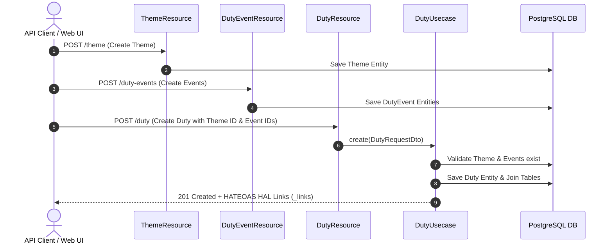
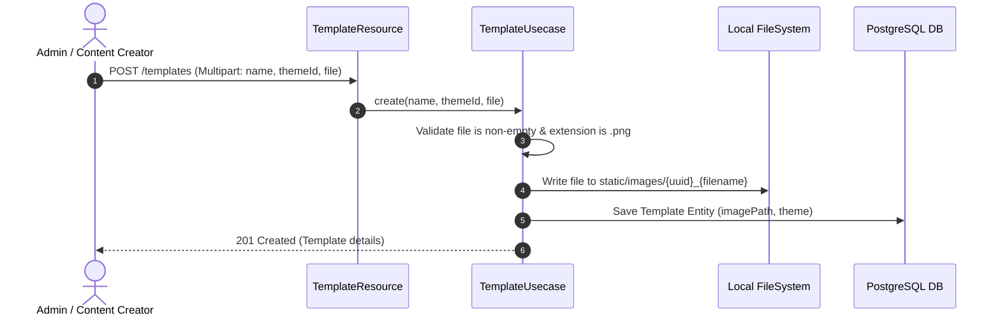
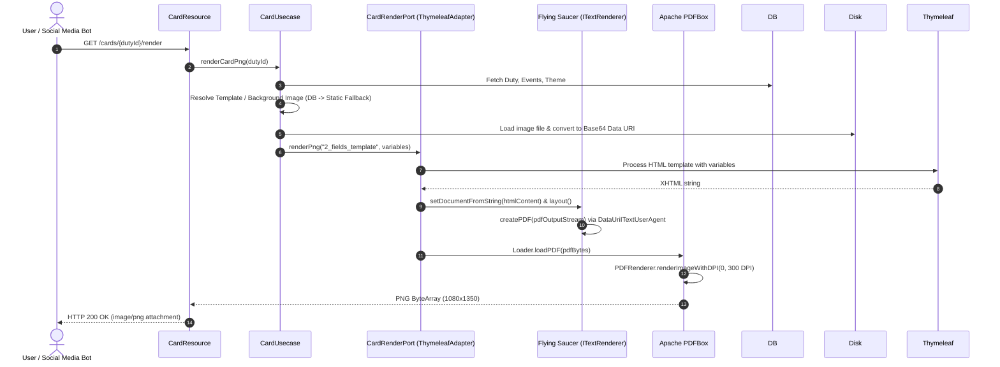
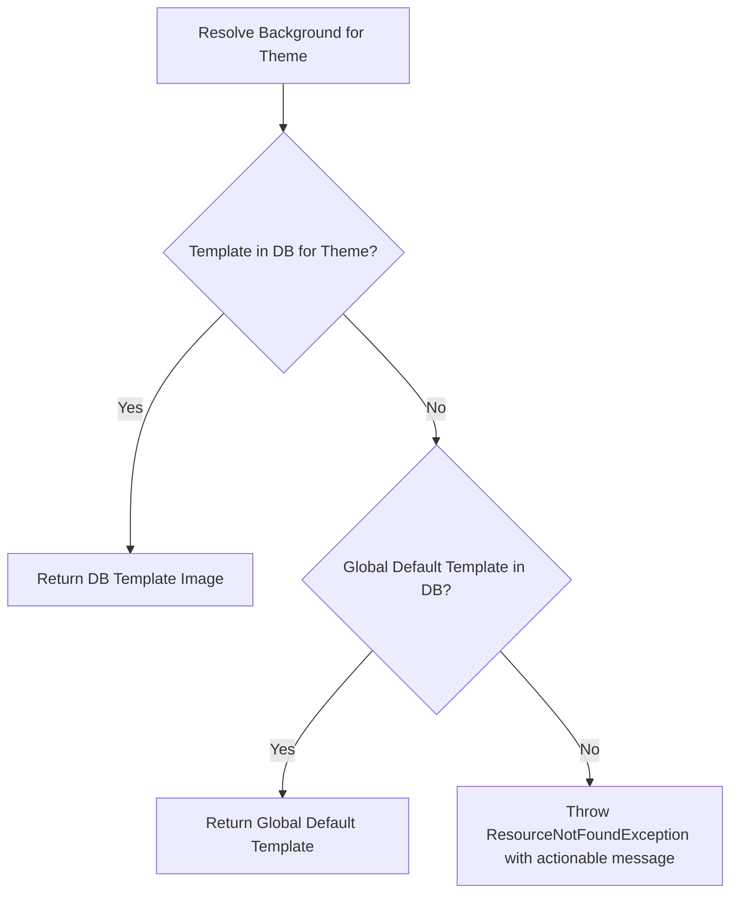
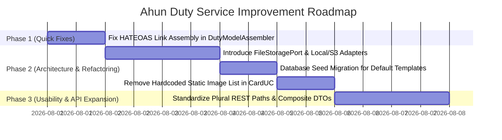

# Ahun Duty Service: Workflow Analysis, Usability Improvements & Architectural Decision Records (ADRs)

## 1. Executive Summary & System Overview

**Ahun Duty Service** is a Spring Boot & Kotlin microservice built with **Hexagonal Architecture** (Ports and Adapters). Its core responsibilities are:
1. **Duty Management**: Scheduling duties (*Giras*, ceremonies, spiritual sessions) assigned to specific dates, semesters, and themes.
2. **Duty Event & Theme Catalog**: Managing reusable themes (*e.g., Exu e Cura, Eres, Pretos Velhos*) and scheduled events within a duty (*e.g., Portas Abertas, Gira de Teste*).
3. **Card & Template Management**: Storing card background image templates linked to themes.
4. **Card Image Generation Engine**: Rendering visual social media announcement cards into HTML previews or high-resolution PNG images using **Thymeleaf**, **Flying Saucer** (`ITextRenderer`), and **Apache PDFBox** (`PDFRenderer`).

---

## 2. Service End-to-End Workflows

### Workflow 1: Duty Management & Event Scheduling



1. **Theme Creation**: Client creates a theme (*e.g., Gira de Exu e Cura*).
2. **Event Creation**: Client creates one or more duty events (*e.g., 18:00 - Abertura dos Trabalhos*).
3. **Duty Creation**: Client creates a `Duty` referencing `themeId` and `eventIds`. The system automatically derives the academic/calendar semester (`SemesterEnum`) and year if omitted.
4. **Query & Hypermedia Navigation**: Duties can be retrieved by ID (`GET /duty/{id}`) or filtered (`GET /duty?theme=...&dutyType=...`). The API returns HATEOAS HAL compliant JSON containing hypermedia navigation links to self, card rendering, and card preview endpoints.

---

### Workflow 2: Template Upload & Asset Management



1. Admin uploads a PNG image file along with a template name and an optional theme binding.
2. The service validates the PNG payload and generates a unique filename (`{uuid}_{sanitizedName}`).
3. The image is saved to the static image repository directory on disk.
4. A database record is saved in the `template` table linking the image path to the specified `Theme`.

---

### Workflow 3: Card Rendering & PNG Image Generation



---

## 3. Comprehensive Usability, Simplicity & Maintainability Assessment

### Key Findings & Friction Points

| Category | Finding / Issue | Impact | Severity |
| :--- | :--- | :--- | :--- |
| **Usability (HATEOAS Bug)** | `DutyModelAssembler.kt` generates card links as `/cards/render/{id}` and `/cards/preview/{id}`, but `CardResource.kt` handles `/cards/{id}/render` and `/cards/{id}/preview`. | Navigating via returned HATEOAS HAL `_links` results in HTTP **404 Not Found**. | **High** |
| **Maintainability** | Hardcoded array of static image filenames inside domain code (`CardUsecase.kt`). | Adding or renaming static background images requires editing Kotlin source code and redeploying the application. | **High** |
| **Architecture / Cloud** | `TemplateUsecase.kt` writes files directly to `System.getProperty("user.dir") + /src/main/resources/static/images`. | In containerized environments (Docker/Kubernetes/JAR execution), writing to `src/main/` fails or files are lost on pod restarts. | **High** |
| **Hexagonal Purity** | `CardUsecase.kt` directly performs disk I/O (`ClassPathResource`, `Base64` encoding) instead of delegating file storage to an outbound port. | Blurs domain and infrastructure boundaries; complicates unit testing. | **Medium** |
| **Developer Usability** | Plural vs Singular REST path inconsistencies (`/duty`, `/theme` vs `/duty-events`, `/templates`, `/cards`). | Confuses frontend developers and external API consumers. | **Medium** |
| **Client Usability** | Creating a Duty requires pre-creating `DutyEvent`s in separate requests. | Multi-step round trips needed for standard duty creation. | **Low** |

---

## 4. Architecture Decision Records (ADRs)

---

### ADR 001: Introduce a Dedicated `FileStoragePort` for Background Assets

* **Status**: Proposed
* **Context**: `TemplateUsecase` and `CardUsecase` currently mix file manipulation logic (`System.getProperty("user.dir")`, `ClassPathResource`, `Base64` string construction) directly inside application use cases. Furthermore, writing to `src/main/resources/` breaks in production/Docker environments.
* **Decision**: Abstract all asset storage behind an outbound port interface `FileStoragePort`. Implement a `LocalFileStorageAdapter` for dev environments and an `S3FileStorageAdapter` (or configurable external directory) for production environments.

#### Proposed Port Interface:
```kotlin
interface FileStoragePort {
    fun store(fileName: String, content: ByteArray): String
    fun loadAsBytes(fileName: String): ByteArray
    fun delete(fileName: String): Boolean
}
```

* **Consequences**:
  - **Positive**: Clean separation of Hexagonal layers. Complete cloud readiness (Docker/K8s/S3). Tests can easily mock file storage without filesystem side-effects.
  - **Negative**: Requires adding a configuration property (`storage.location` or `storage.provider`).

---

### ADR 002: Dynamic Database-Driven Asset Resolution (Eliminate Hardcoded Image List)

* **Status**: Proposed
* **Context**: `CardUsecase.kt` maintains a hardcoded Kotlin `listOf(...)` containing 13 background PNG file names. If a theme has no database template record, it performs regex matching against this static array.
* **Decision**: Remove the hardcoded image list from application code. Store default background templates directly in the `template` database table (e.g. via Flyway seed scripts with `is_default = true` or `theme_id = NULL` fallback).



* **Consequences**:
  - **Positive**: Adding new templates requires zero code changes or redeployments—simply upload via `POST /templates`.
  - **Negative**: Requires updating initial Flyway migration scripts to seed default template records in the database.

---

### ADR 003: Standardize REST Endpoints & Fix HATEOAS Link Resolution

* **Status**: Proposed
* **Context**: 
  1. HATEOAS links in `DutyModelAssembler.kt` point to invalid paths (`/cards/render/{id}` instead of `/cards/{id}/render`).
  2. Resource mappings use mixed conventions (`/duty`, `/theme` vs `/cards`, `/templates`, `/duty-events`).
* **Decision**: 
  1. Update `DutyModelAssembler.kt` so generated HATEOAS URLs accurately reflect `/cards/{id}/render` and `/cards/{id}/preview`.
  2. Standardize REST resource paths to plural noun conventions: `/duties`, `/themes`, `/duty-events`, `/templates`, `/cards`.

#### Comparison Table:
| Current Route | Standardized Proposed Route | HATEOAS Link Generated |
| :--- | :--- | :--- |
| `/duty` | `/duties` | `GET /duties/{id}` |
| `/cards/{dutyId}/render` | `/cards/{dutyId}/render` | `GET /cards/{dutyId}/render` |
| `/cards/{dutyId}/preview` | `/cards/{dutyId}/preview` | `GET /cards/{dutyId}/preview` |
| `/theme` | `/themes` | `GET /themes/{id}` |
| `/duty-events` | `/duty-events` | `GET /duty-events/{id}` |

* **Consequences**:
  - **Positive**: Fixes broken HATEOAS navigation links. Provides intuitive, standard RESTful API conventions for frontend consumers.
  - **Negative**: Requires backwards-compatibility redirects or updating existing client callers if endpoint base paths change.

---

### ADR 004: Composite Duty Creation (Inline Event Assignment)

* **Status**: Proposed
* **Context**: Creating a new Duty requires clients to first issue `POST /duty-events` to receive event UUIDs, then issue `POST /duty` passing `eventIds: [UUID]`. This forces multiple network round-trips for common scenarios.
* **Decision**: Extend `DutyRequestDto` to support optional inline event payloads (`events: List<DutyEventRequestDto>?`), enabling single-transaction Duty + Events creation.

```json
// Example Composite Duty Request Body
{
  "themeId": "a1b2c3d4-0000-0000-0000-000000000001",
  "dutyType": "OPENED_GIRA",
  "date": "2026-08-15",
  "description": "Gira de Homenagem",
  "inlineEvents": [
    {
      "name": "Passe e Cura",
      "startedAt": "2026-08-15T18:00:00",
      "visibleInCard": true
    }
  ]
}
```

* **Consequences**:
  - **Positive**: Significantly improves developer usability and reduces API round-trips.
  - **Negative**: Slightly increases `DutyUsecase.create` logic complexity.

---

## 5. Summary Recommendation Roadmap


