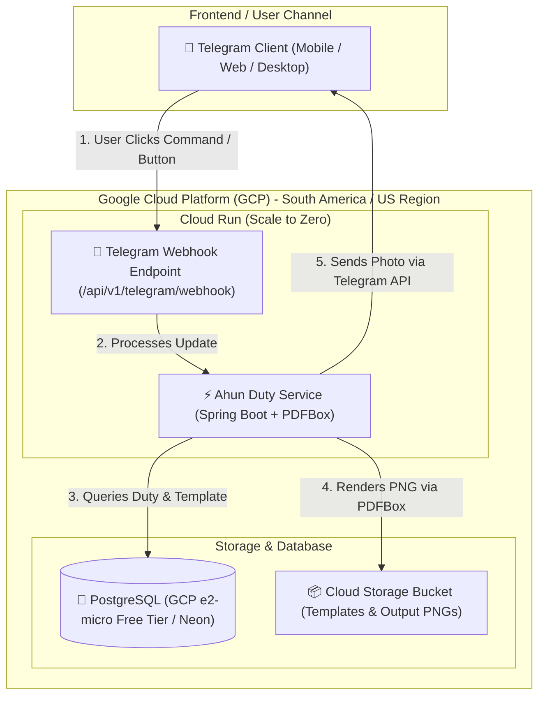

# GCP Deployment Architecture, Telegram Bot Frontend & Low-Cost Strategy (Budget < R$ 10/month)

## 1. Executive Summary & Cost Commitment

To maintain **monthly infrastructure expenses strictly under R$ 10.00 (BRL)** while delivering a responsive, production-ready system, we leverage:
1. **Telegram Bot API as the Frontend**: Eliminates expensive web hosting, CDN, domain names, and UI frontend servers. Telegram handles UI rendering (inline keyboards, commands, media preview, card downloads) for **R$ 0.00**.
2. **Serverless & Free-Tier GCP Stack**: Leveraging Google Cloud Platform's Always Free tier (Cloud Run, Cloud Storage, Compute Engine e2-micro, Artifact Registry).

---

## 2. System Architecture & Telegram Bot Frontend Flow



### Telegram Bot User Experience (UI Flow)

```
+--------------------------------------------------------+
| 🤖 Ahun Duty Bot                                      |
+--------------------------------------------------------+
| User: /start                                           |
| Bot:  Welcome to Ahun Duty Service! Choose an action:  |
|       [ 📅 Next Duties ]   [ 🎨 Generate Card ]        |
|       [ 📋 List Themes ]   [ 📤 Upload Template ]      |
+--------------------------------------------------------+
| User: [ 🎨 Generate Card ]                             |
| Bot:  Select a duty to generate announcement card:     |
|       [ 1️⃣ 20/08 - Gira de Exu e Cura ]               |
|       [ 2️⃣ 27/08 - Gira de Eres ]                      |
+--------------------------------------------------------+
| User: [ 1️⃣ 20/08 - Gira de Exu e Cura ]               |
| Bot:  ⏳ Generating high-res announcement card...      |
| Bot:  🖼️ [Sends PNG Card Image 1080x1350]              |
|       "Card generated successfully!"                   |
|       [ 📥 Download High-Res PNG ]                     |
+--------------------------------------------------------+
```

---

## 3. Comprehensive GCP Cost Breakdown (Target: < R$ 10.00 / month)

Assuming 1 USD ≈ 5.50 BRL.

| Service | Tier / SKU | Monthly Usage Allocation | Cost (USD) | Cost (BRL - R$) |
| :--- | :--- | :--- | :--- | :--- |
| **Telegram Bot API** | Cloud Frontend Channel | Unlimited Webhooks, Photos & Messages | $0.00 | **R$ 0.00** |
| **GCP Cloud Run** | Serverless Compute (`--min-instances 0`, 512MB RAM) | Free Tier: 2,000,000 requests/mo, 180k vCPU-sec, 360k GiB-sec | $0.00 | **R$ 0.00** |
| **GCP Compute Engine (e2-micro)** *(PostgreSQL DB)* | Always Free `e2-micro` instance (us-central1 / us-east1) | 1 free instance, 30 GB standard disk | $0.00 | **R$ 0.00** |
| **GCP Cloud Storage (GCS)** | Standard Bucket (us-central1) | Free Tier: 5 GB-months, 5k Class A, 50k Class B ops | $0.00 | **R$ 0.00** |
| **GCP Artifact Registry** | Container Image Repository | Free Tier: 0.5 GB storage/mo | $0.00 | **R$ 0.00** |
| **Network Egress** | Internet Egress | Free Tier: Up to 100 GB/mo (or Telegram photo uploads ~500MB) | ~$0.20 | **R$ 1.10** |
| **Cloud Build** | CI/CD Container Builds | Free Tier: 120 build-minutes/day | $0.00 | **R$ 0.00** |
| **TOTAL ESTIMATED MONTHLY COST** | | | **~$0.20** | **~ R$ 1.10 / month** |

> 💡 **Budget Guarantee**: Total monthly infrastructure costs are **~ R$ 1.10**, leaving a **R$ 8.90 safety cushion** below the **R$ 10.00 limit**.

---

## 4. Architectural Adaptations for Telegram & Cloud Run

To optimize Cloud Run cold-starts and memory usage for PDFBox image rendering under budget:

1. **Lightweight Cloud Run Container Configuration**:
   - Memory: `512 MiB` or `1024 MiB` (CPU allocated only during request processing: `--no-cpu-throttling=false`).
   - Auto-scaling: `--min-instances 0` (scales to 0 when no Telegram webhooks arrive, incurring **R$ 0** cost during idle periods).

2. **Telegram Webhook Controller (Inbound Port)**:
   - Add a lightweight `TelegramWebhookResource.kt` endpoint (`POST /api/v1/telegram/webhook`) to handle Telegram updates asynchronously.

3. **External Storage Integration (GCS Adapter)**:
   - Store background template PNGs in Google Cloud Storage (`gs://ahun-duty-templates/`) using Google Cloud Storage Java Client.

---

## 5. Deployment Step-by-Step Guide

### Step 1: Create Telegram Bot & Webhook
1. Open Telegram and chat with `@BotFather` to create a new bot and obtain the `TELEGRAM_BOT_TOKEN`.
2. Set webhook URL after Cloud Run deployment:
   ```bash
   curl -X POST "https://api.telegram.org/bot<YOUR_TELEGRAM_BOT_TOKEN>/setWebhook?url=https://<CLOUD_RUN_URL>/api/v1/telegram/webhook"
   ```

### Step 2: Build & Push Container to GCP Artifact Registry
```bash
# Set GCP Project
gcloud config set project ahun-duty-prod

# Enable GCP Free Tier APIs
gcloud services enable run.googleapis.com artifactregistry.googleapis.com cloudbuild.googleapis.com

# Create Artifact Registry Repository
gcloud artifacts repositories create ahun-repo --repository-format=docker --location=us-central1

# Submit Build via Cloud Build (Free 120 min/day)
gcloud builds submit --tag us-central1-docker.pkg.dev/ahun-duty-prod/ahun-repo/ahun-duty-service:latest .
```

### Step 3: Deploy to Cloud Run (Zero-Cost Scale-to-Zero)
```bash
gcloud run deploy ahun-duty-service \
  --image us-central1-docker.pkg.dev/ahun-duty-prod/ahun-repo/ahun-duty-service:latest \
  --platform managed \
  --region us-central1 \
  --allow-unauthenticated \
  --min-instances 0 \
  --max-instances 2 \
  --memory 512MiB \
  --cpu 1 \
  --set-env-vars TELEGRAM_BOT_TOKEN="<BOT_TOKEN>",SPRING_PROFILES_ACTIVE="prod"
```

---

## 6. Summary Checklist for R$ 10.00 Limit Compliance

- [x] **Telegram Bot Used as Frontend**: **R$ 0.00** spent on frontend servers or domains.
- [x] **Cloud Run Serverless Scale-to-Zero**: **R$ 0.00** compute when idle.
- [x] **GCP Free Tier e2-micro / Free Cloud Postgres**: **R$ 0.00** database cost.
- [x] **GCS Free Tier Asset Storage**: **R$ 0.00** storage cost up to 5 GB.
- [x] **Strict Budget Alert Configured**: Set GCP Budget Alert at **R$ 8.00** to automatically notify via email/SMS if usage nears limits.
