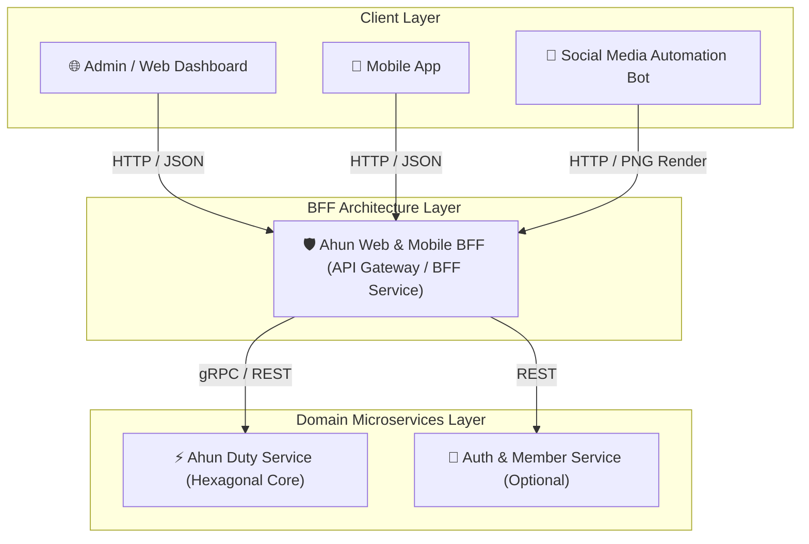
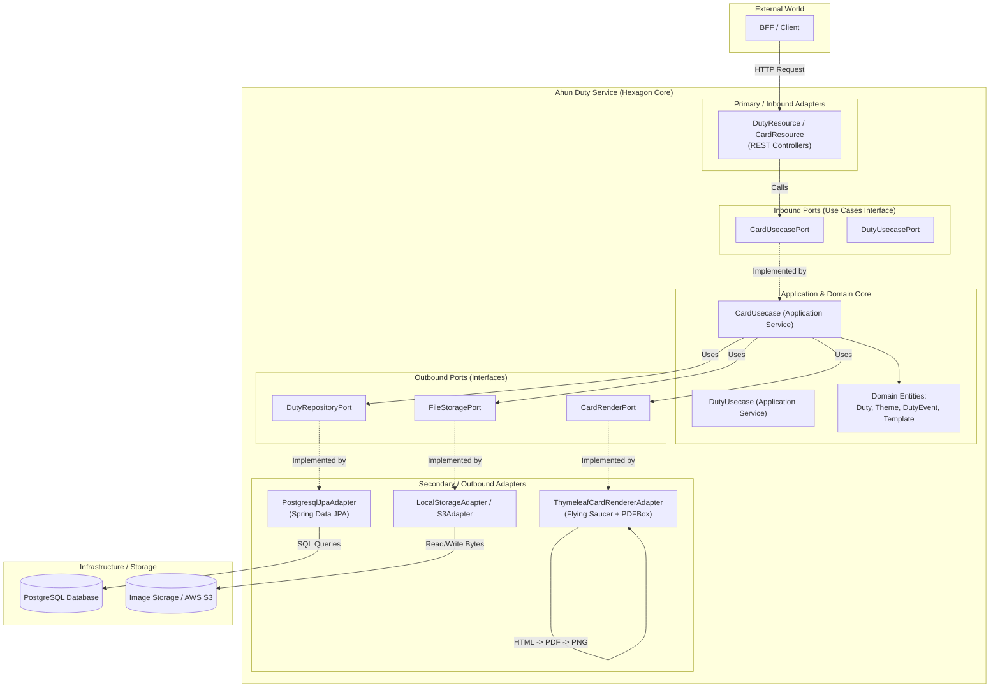
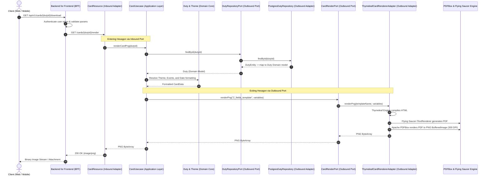

# Hexagonal Architecture & Backend-for-Frontend (BFF) Workflow

## 1. High-Level System Topology (BFF + Microservices)

In a modern client ecosystem (Web App, Mobile App, Social Media Automation Bots), a **Backend-For-Frontend (BFF)** layer sits between clients and core domain microservices like `ahun-duty-service`.

The **BFF** handles:
- Client-specific DTO aggregation (*e.g., combining Duty details + Theme preview + Card URL in a single response*).
- Authentication / Authorization headers validation.
- Response shaping and image caching headers.

---

## 2. Hexagonal Architecture (Ports & Adapters) Inside `ahun-duty-service`

The `ahun-duty-service` strictly segregates domain business logic from framework and infrastructure code using Hexagonal Architecture.

---

## 3. End-to-End Sequence Flow: Requesting a Card PNG

Below is the complete trace when a mobile/web user triggers a card generation request via the BFF down to the Flying Saucer + PDFBox rendering pipeline inside `ahun-duty-service`.

---

## 4. Key Architectural Pillars

### 1. BFF Layer Responsibility
- **Decoupling**: Prevents frontends from depending on internal microservice entity schemas.
- **Aggregation**: A single BFF call can query `/duties/{id}`, fetch the `/cards/{id}/preview` HTML snippet, and package it into a rich JSON for the UI.
- **Optimized Delivery**: Handles caching headers (`Cache-Control`, `ETag`) for rendered cards.

### 2. Hexagonal Architecture Benefits in `ahun-duty-service`
- **Port Swappability**: Flying Saucer + PDFBox is encapsulated behind `CardRenderPort`. If requirements change to Playwright, Puppeteer, or AWS Lambda rendering, **zero business logic in `CardUsecase` changes**.
- **Database Independence**: Domain model `Duty` is isolated from JPA `DutyEntity` via `DutyRepositoryPort`.
- **Testability**: `CardUsecase` can be thoroughly unit tested using simple mocks for `CardRenderPort` and `DutyRepositoryPort` without starting Spring contexts or databases.
